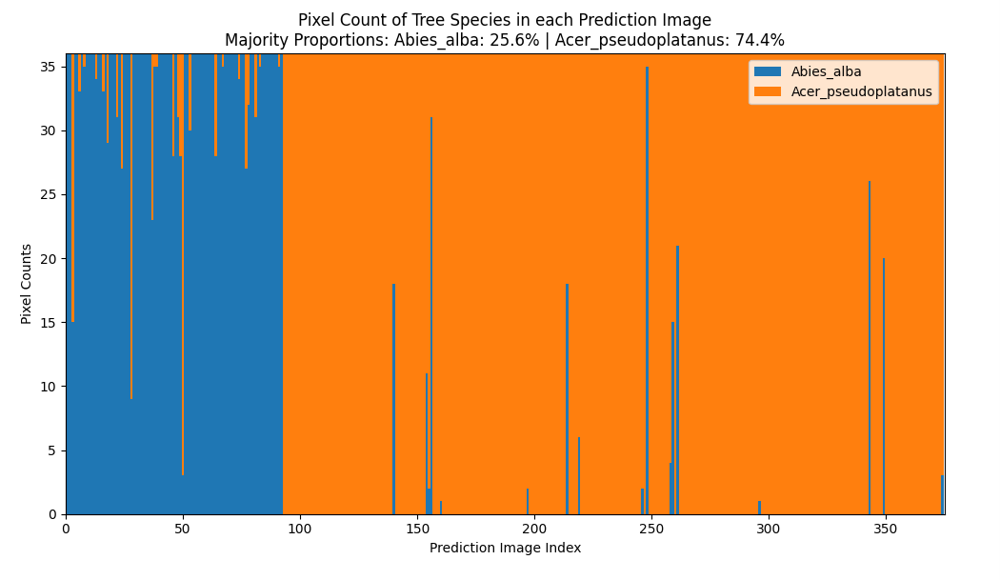
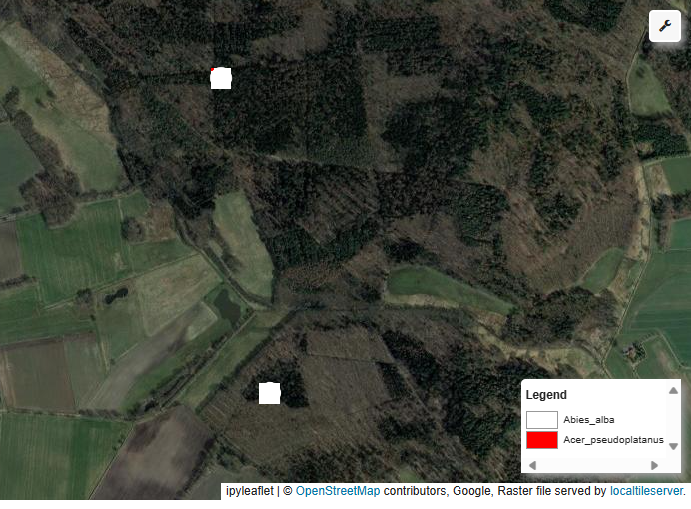
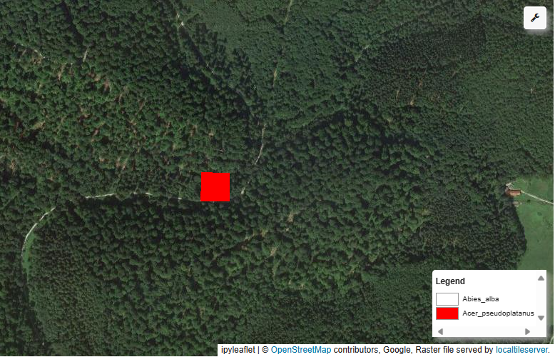
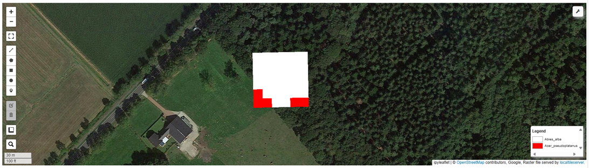
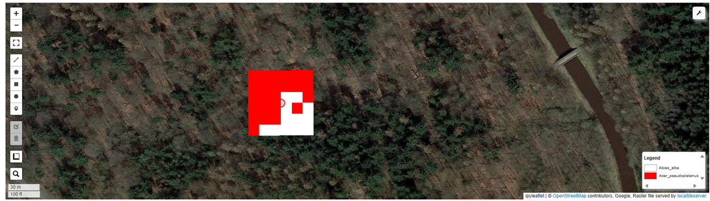

### Final project report

The final report will provide a written summary of your project,
including the progress you achieved since the presentation. It should
answer the following questions:

1.  What is the overall aim of the project and what specific Earth
Observation problem is it trying to solve?
Mapping farm management and yield outcomes at broad geographical scales requires first mapping crop types at the field resolution. 
Given that the number of people living in areas experiencing food insecurity is still rising and that climate change is expected to 
have a negative impact on global agriculture, this mission is even more pressing (Kluger et al., 2021). Tackling this challenge involves 
the creation of models that can effectively generalize from limited labeled data, thereby expanding our capacity to address a wider array 
of Earth observation tasks (Bourcier et al., 2022). In an effort to expand the use of machine learning application to where labeled datasets 
are scarce, this problem has sparked research on self-supervised learning for remote sensing data.

In this project, we will employ the Pretrained Remote Sensing Transformer
(Presto), a transformer-based model pre-trained on remote sensing pixel-timeseries data for the downstream task of mapping agricultural fields 
in Africa. Tseng et al. (2023) claim that the Presto model can handle a variety of tasks, landscapes, data size and require lower computing power 
than other popular models. The project will adapt their [downstream_task_demo.ipynb](https://github.com/nasaharvest/presto/blob/main/downstream_task_demo.ipynb) 
notebook to run on Sentinel-2 data with labels for agricultural fields in Kenya's Busia County. The goal of the project is to determine the viability of using this 
foundational model for future research that require mapping of agricultural fields.
Our specific objective is to segment the satellite imagery into two (cropfield/not cropfield) or three (cropfield/cropfield border/not cropfield) classes.

2.  What were the methods you developed and/or applied?

3.  What were your results?

Figure 1 is the distribution of tree species in each prediction image.
The x-axis are the all the 375 test data which the random forest classifier
was used for the prediction. While the y-axis show the prediction proportion of 
the species for each of the 36 pixels per each test data iamge. From the predictions,
We catergorized the predicted test data based on the majority of pixels in each image 
per the each species. From this categorization, a total of 26% of the 375 test images 
has majority of the piexls prediction being Albies_alba species. While the 74% of all 
the predictions had a majority of Acer_pseudoplatanus species.

Figure 2 show the spatial distribution of the predicted test data in Germany
Form the figure, Abies_alba are predominantly in northern Germany, and Acer_pseudoplatanus are predominant species in southern Germany. 

Figure 3. Random predicted image with majority species as Abies_alba species, 
Which means all the 36 pixels in the 6 x 6 image are predicted as Abies_alba species.

Figure 4. Random predicted image with majority species as Acer_pseudoplatanus species, 
Which means all the 36 pixels in the 6 x 6 image are predicted as Acer_pseudoplatanus species.

Figure 5. Random predicted image that has mixed prediction. 
The image has 31 pixels predicted as Abies_alba species and 5 piexls predicted as Acer_pseudoplatanus. Since Abies_alba species has greater proportion, the image is 
classified as Abies_alba species.

Figure 6. Random predicted image that has mixed prediction. 
The image has 12 pixels predicted as Abies_alba species and 24 piexls predicted as Acer_pseudoplatanus. Since Acer_pseudoplatanus species has greater proportion, the image is classified as Acer_pseudoplatanus species.

4.  Did the results show that the project aim was realized? Was an Earth
    Observation limit pushed back (or potentially pushed back)? If this
    was a group project, how were the results of individual efforts
    integrated?

5.  What are potential improvements, and any next steps you plan to
    take?
Our project was organized in two phases, each with distinct objectives. Initially, our focus was on comprehending the Presto model 
from the creators and then leveraging it to first  generate predictions for the provided test data.This required us to delve deep into 
the methods of the Presto model, understanding its underlying mechanisms, and applying it effectively to make predictions.  
Secondly after thoroughly understanding and getting the model to generate predictions, we planned  to apply it to busia_cropland_binary_2020.tif 
dataset. The dataset, a 10-meter resolution map depicting cropland in Busia County, Kenya during the 2020-2021 growing season, presented an essential 
binary classification challenge. The binary map utilized a coding system where 0 denoted no cropland, and 1 indicated the presence of cropland. This 
dataset was obtained with thresholding predictions of an LSTM classifier trained on multi-spectral S2 time series.
Despite our project plans and potential of the Presto model, we encountered challenges in getting the model to run initially which was resolved. We also 
encountered challenges in getting it to generate predictions for more than two tree species. Hence, our predictions were limited to the test data for only 
two tree species, namely "Abies_alba" and "Acer_pseudoplatanus" predominantly found in Germany. This limitation prompted us to explore the adaptability and 
scalability of the model. Our subsequent endeavors aim to assess the model's performance when tasked with predicting more than two species, thereby broadening 
its applicability and utility.
The next steps of our project involve refining the Presto model to be able to make predictions of tree species, going beyond the initial scope of two. Furthermore, 
a crucial aspect of  the project is to determine how we could adapt Presto and apply to datasets distinct such us our dataset for busia_cropland_binary_2020.tif  
which is different from the ones it was originally trained on.

The format of your submission should be styled more like a README or
extended tutorial on a software repository than a final paper. That
means, that most, if not all, of you should write this in Markdown or
Rmarkdown document, presenting code and figures that demonstrate your
methods and results along with your text. Longer scripts can be provided
as separate source files for the relevant language. So please structure
the final projects in a folder like this:

    - project_name
      |- data
      |- docs
      |- scripts

The docs folder contains your Markdown/Rmarkdown file (or other document
if needed, but please discuss), data contains any accompanying data, and
scripts and longer source code that you can link to in your document.
Ultimately, this structure will help us integrate some of the results
into this repo, so that next year’s class can build on your good work
(note: we don’t have to do this in all cases, so we will only do this
based on mutual agreement).

In terms of structure, we want to be less texty and more visual.
Question 1 should be addressed in ~500 words. Question 2 should be
answered using as many words, text, and code snippets as needed to make
the method and your steps reproducible (i.e. someone could read and
figure out how to get the same results you show). Question 3 is better
to answer with figures and tables, and as much text as needed to
describe what the figures are showing. Questions 4 and 5 should together
be answered in **no more** than 500-1000 words, depending on how many
people are in your group.

Since this is a methods class, Questions 2 and 3 hold the greatest
interest, and here is where the size of the group matters. More detail
is expect in these sections, reflecting the subdivision of work

The format you follow in terms of headings and structure can be flexible
as long as the questions above are addressed. It should be submitted as
a single project/report, but each member should write the section that
describes their contribution, while writing in any common sections can
be divided equitably between team members. Please use initials to denote
your parts of the writing.

The following provides a working overview of the paper/report structure:

Assessment is out of 60 pts (note that there is a minimum points floor,
which assumes that a final project has been submitted), and will be
based on three categories (the rubric is nearly identical to the
presentation, but considered in terms of written rather than presented
materials):

- **Quality** evaluates the *content* of the material in your final
  method, focusing on the information and ideas conveyed in your
  descriptions, figures, and tables. How well did you understand and
  execute the project, and how well did you convey what you did? \[30
  points\]
- **Progress** evaluates whether you achieved the objectives put forward
  in your project proposal and final presentation, focusing more on the
  latter due to course corrections (and incorporating any necessary
  changes we discussed) \[15 points\]
- **Clarity** examines the clarity of the writing (is it easy to
  understand, no typos or missed words), the visual aspects of figures
  (does the color choice make sense, legend sensible, size appropriate,
  text readable?), formatting (did html lists end up as lists? do
  headings make sense?), and code syntax. This basically covers the
  stylistic components of your vignettes and code. \[15 points\]

*Rubric*

Codes:

- Assessment sub-categories
  - OM = How well were the objectives/methods/goals of the project
    understood?
  - CON = How much contributed to project?
  - CRE = Creativity/problem-solving
  - NAR = Was the narrative clear?
  - WRI = How clear/effective/tidy was the writing?
- Modifiers:
  - N = No, None, or Not (as in unclear)
  - NV = Not very, not very much
  - F = Fair, fairly
  - H = Highly, outstanding
  - PT = Perfect timing

| Quality               | Quality pts | Progress | Progress pts | Clarity                 | Clarity pts |
|-----------------------|-------------|----------|--------------|-------------------------|-------------|
| OM N, CON N, CRE N    | 0           | N        | 0            | NAR N, NAR N, TIM WRI N | 0           |
| OM NV, CON NV, CRE NV | 20          | NV       | 9            | NAR NV, NAR NV, WRI N/F | 9           |
| OM F, CON F, CRE F    | 25          | F        | 12           | NAR F, NAR F, WRI F     | 12          |
| OM H, CON H, CRE H    | 30          | H        | 15           | NAR H, NAR H, WRI H     | 15          |

## Time Commitment

The following provides an approximate breakdown for the 180 total hours
you are expected to spend on this class over the course of the semester:

|                                                                 |          |
|-----------------------------------------------------------------|----------|
| Class meetings (1.25 hours/class X 27 )                         | 34 hours |
| Assigned readings, tutorials, and coding (7.5 hours X 10 weeks) | 75 hours |
| Analysis leading to final projects (12.75 hours X 4 weeks)      | 51 hours |
| Write up final projects (10 hours X 2 weeks)                    | 20 hours |

## Communications

We will conduct class communications via a Slack channel that you should
already be invited to. Please don’t send emails. We use Slack because it
keeps relevant conversations in defined places, rather than scattered
across email inboxes.

## Academic Dishonesty

University’s policies on academic integrity will be strictly enforced.
Plagiarism, cheating, lying, stealing, or falsification will not be
tolerated and will be referred to the University Administration. Please
go
[here](https://catalog.clarku.edu/content.php?catoid=32&navoid=2735#academic-integrity)
to learn more about this policy and what it entails.

## Additional Information

### Student Accessibility Services

Clark University is committed to providing students with documented
disabilities equal access to all university programs and facilities.
Students are encouraged to register with Student Accessibility Services
(SAS) to explore and access accommodations that may support their
success in their coursework. SAS is located on the second floor of the
Shaich Family Alumni and Student Engagement Center (ASEC). Please
contact SAS at <accessibilityservices@clarku.edu> with questions or to
initiate the registration process. For additional information, please
visit the [SAS
website](https://www.clarku.edu/offices/student-accessibility-services/).

### FERPA Policy

The link to Clark’s policy regarding student privacy under the Family
Education Rights and Privacy Act is available
[here](https://www.clarku.edu/offices/registrar/ferpa/)

### Title IX

Please be aware that all Clark University faculty and teaching
assistants are considered responsible employees, which means that if you
tell us about a situation involving the aforementioned offenses, we must
share that information with the Title IX Coordinator, Brittany Brickman
(<titleix@clarku.edu>). Although we must make that notification, you
will, for the most part, control how your case will be handled,
including whether or not you wish to pursue a formal complaint. Our goal
is to make sure you are aware of the range of options available to you
and have access to the resources you need. 

If you wish to speak to a confidential resource who does not have this
reporting responsibility, you can contact Clark’s Center for Counseling
and Professional Growth (508-793-7678), Clark’s Health Center
(508-793-7467), or confidential resource providers on campus (see
[here](https://www.clarku.edu/offices/title-ix/resources/) for a list,
and for other resources).

|                                |                         |                                         |                                       |                                     |
|--------------------------------|-------------------------|-----------------------------------------|---------------------------------------|-------------------------------------|
| [Course Home](../../README.md) | [Syllabus](syllabus.md) | [Syllabus details](syllabus-details.md) | [Course Policies](course-policies.md) | [Projects](../projects/projects.md) |

